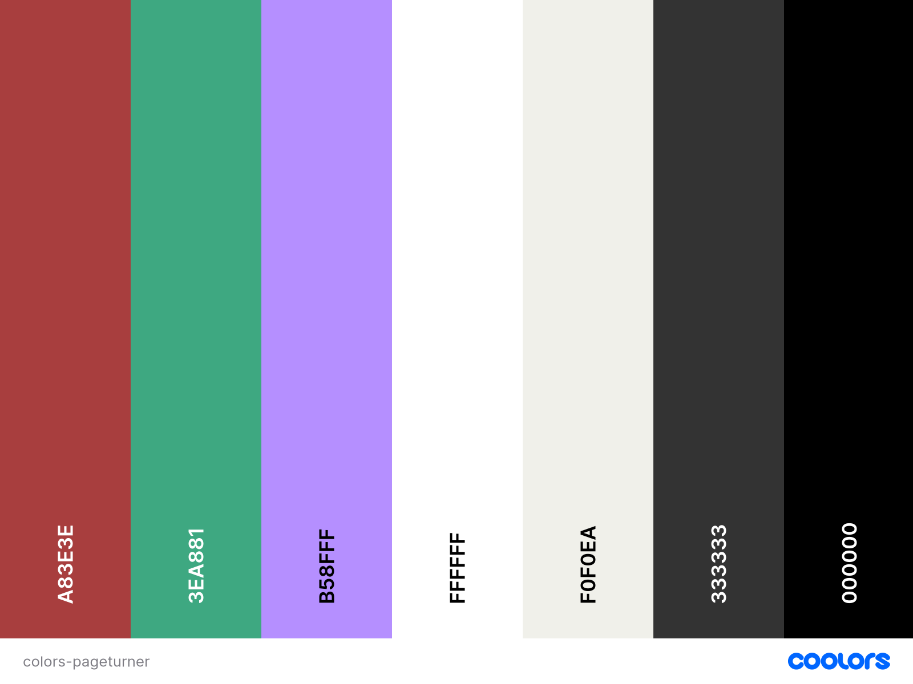
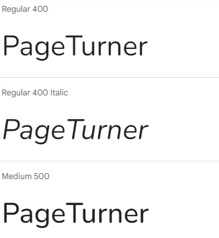
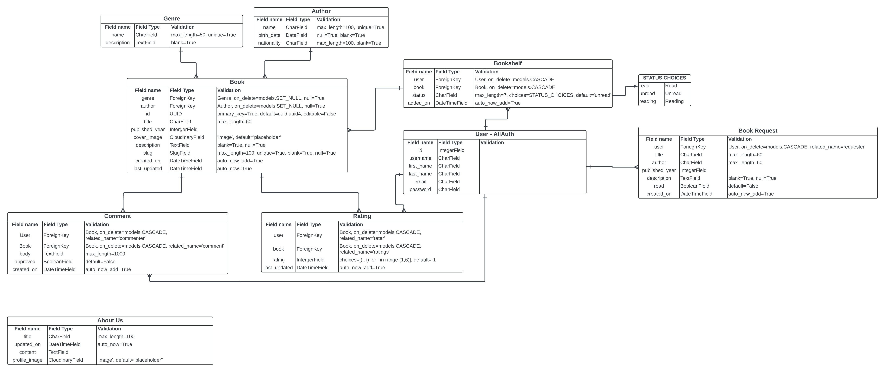
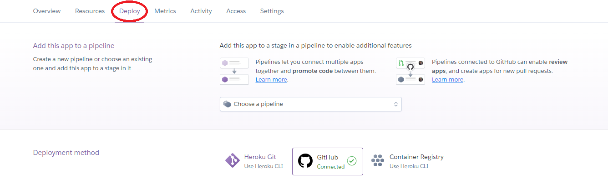
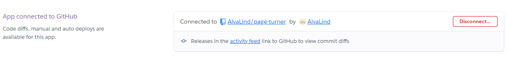
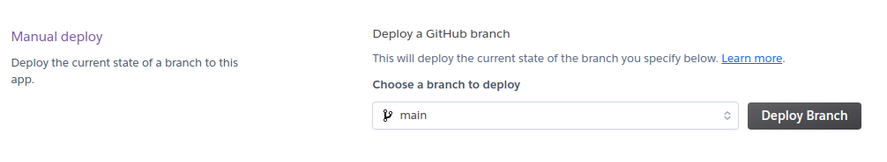
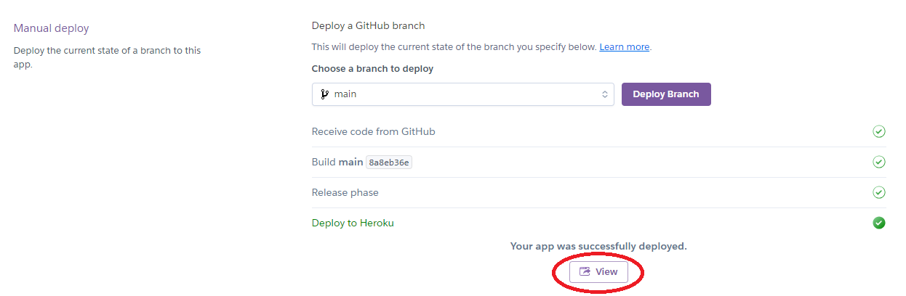

Welcome,

This is the Code Institute student template for Codeanywhere. If you are using Gitpod then you need [this template](https://github.com/Code-Institute-Org/gitpod-full-template) instead.  We have preinstalled all of the tools you need to get started. It's perfectly ok to use this template as the basis for your project submissions.

You can safely delete this README.md file, or change it for your own project. Please do read it at least once, though! It contains some important information about Codeanywhere and the extensions we use. Some of this information has been updated since the video content was created. The last update to this file was: **August 30th, 2023**

## Codeanywhere Reminders

To run a frontend (HTML, CSS, Javascript only) application in Codeanywhere, in the terminal, type:

`python3 -m http.server`

A button should appear to click: _Open Preview_ or _Open Browser_.

To run a frontend (HTML, CSS, Javascript only) application in Codeanywhere with no-cache, you can use this alias for `python3 -m http.server`.

`http_server`

To run a backend Python file, type `python3 app.py`, if your Python file is named `app.py` of course.

A button should appear to click: _Open Preview_ or _Open Browser_.

In Codeanywhere you have superuser security privileges by default. Therefore you do not need to use the `sudo` (superuser do) command in the bash terminal in any of the lessons.

To log into the Heroku toolbelt CLI:

1. Log in to your Heroku account and go to _Account Settings_ in the menu under your avatar.
2. Scroll down to the _API Key_ and click _Reveal_
3. Copy the key
4. In Codeanywhere, from the terminal, run `heroku_config`
5. Paste in your API key when asked

You can now use the `heroku` CLI program - try running `heroku apps` to confirm it works. This API key is unique and private to you so do not share it. If you accidentally make it public then you can create a new one with _Regenerate API Key_.

---

Happy coding!
## Terminal commands: 

Run server 
```shell
python manage.py runserver  
```

Run server with local settings
```console
python manage.py runserver --settings page_turner.local_settings
```

Make directories 
```
mkdir location/new_directory_name
```

Check migrations for model changes
```
python manage.py makemigrations --dry-run
```    

Make migrations for model changes
```
python manage.py makemigrations
```    

Migrate database
```bash
python manage.py migrate
```

Create super user
```
python manage.py createsuperuser
```

Generating the static files
```
python manage.py collectstatic  
```                                   

Check
```
python manage.py check
```

Install dependencies
```
pip install -r .\requirements.txt
```

Update requirements.txt with latest versions of installed packages
```
pip freeze > requirements.txt
```

flush/delete existing data from databases 
```
python3 manage.py flush
```

Install Python Imaging Library - Pillow library. Required for book cover images.
```
pip3 install cloudinary~=1.36.0 dj3-cloudinary-storage~=0.0.6 urllib3~=1.26.15
```


Copy the templates from the allauth package to the project's templates directory for windows
```
xcopy "C:\Users\alval\AppData\Local\Packages\PythonSoftwareFoundation.Python.3.12_qbz5n2kfra8p0\LocalCache\local-packages\Python312\site-packages\allauth\templates\*" ".\templates\" /S /E
```

Install crispy forms and crispy bootstrap
```
pip3 install django-crispy-forms~=2.0 crispy-bootstrap5~=0.7
```

# PageTurner

*You can find the link to [PageTurner here](https://)*

Welcome to PageTurner, where booklovers come together to explore, and delve into the captivating realm of literature. Explore a wide-ranging collection of various genres and authors, including classics and the latest bestsellers. Engage with our library, share your thoughts through reviews/comments, and build your personalised bookshelf to track your literary journey. Whether you're an addicted reader, a casual bookworm, or someone just starting their reading journey, PageTurner is your haven. 

Join us and turn the page to your next adventure in literature!

## User Experience

### Target Audience:
PageTurner is designed for:

* Book Enthusiasts: Whether you're a passionate reader looking for your next favorite book or a casual reader exploring new genres, PageTurner offers a diverse selection to cater to all tastes.

* Readers Seeking New Reads: Users looking to discover their next favorite book can explore PageTurner's extensive library. They can view ratings and insightful comments provided by fellow readers to make informed decisions and find books that resonate with their interests and preferences.

* Book Collectors: Users who want to curate and maintain a digital library of books they have read, are currently reading, or plan to read in the future. 

* Community-Oriented Readers: Readers who enjoy sharing their opinions through book reviews/comments and ratings to contribute to the community. 

### Strategy:
PageTurner's strategy revolves around:

* Curated Content: *Continuously update and expand our book collection to ensure a broad range of genres and authors are represented.*

* Community Engagement: *Foster a vibrant community where readers can share opinions on books through comments and ratings.*

* User Feedback: *Regularly gather and incorporate user book requests to improve the platform and meet the evolving needs of our community.*

### User Stories:

| User Story |
|------------|
| As a User, I can view the homepage to see the most recently uploaded books and understand the purpose of the website. |
| As a User, I can view the homepage to see the most recently uploaded books and understand the purpose of the website. |
| As a User, I can register for an account so that I can gain access to additional features. |
| As a User, I can view the about us page so that I can learn about the website and its creator. |
| As a User, I can view a books detail page to see a specific books details. |
| As a User, I can search for books by genre, author, or title so that I can find books of interest. | 


| Registered User Story |
|-----------------------|
| As a Registered User, I can log in to my account so that I can access personalized features and data. |
| As a Registered User, I can add a book to my favorites so that I can easily find and access it later. |
| As a Registered User, I can rate a book so that I can share my rating with others. |
| As a Registered User, I can comment on a book so that I can share my thoughts and feedback. |
| As a Registered User, I can edit my comments so that I can correct or update my feedback. |
| As a Registered User, I can request a book so that the admin considers adding it to the database. |
| As a Registered User, I can update my profile information so that my account details are current. |

| Admin User Story |
|------------------|
| As an Admin, I can manage user accounts so that I can maintain the integrity of the user base and handle any issues. |
| As an Admin, I can access the about us admin interface so that I can update the text and image. |
| As an Admin, I can approve user comments so that only appropriate comments are displayed on the book detail pages. |
| As an Admin, I can mark book requests as read so that I can keep track of which requests have been reviewed. |
| As an Admin, I can upload a new book to the database so that users can access and search for it. |

## Features

## Design

### Color Scheme

PageTurner has a color palette that not only reflects modernity but also aims to uplift and engage their users. 



* **#A83E3E:** for primary buttons.  
This color gives the feeling of passion and energy, inviting users to take action and explore further. The vibrant hue of red-orange ignites enthusiasm and signifies PageTurner's commitment to providing an exciting reading journey.
* **#3EA881:** for highlight.  
This highlight color, brings a refreshing touch of tranquility and growth. Evoking the calming essence of nature, it encourages users to discover new books with a sense of serenity and exploration.
* **#B58FFF:** for secondary buttons and homepage styles.  
This shade of lavender-purple infuses a sense of elegance and invites users to immerse themselves in our curated collections with curiosity and delight.
* **#FFFFFF:** for background color in the bookcards and the comment section.  
This color promotes readability and focus. Its clean, crisp appearance creates a canvas where information shines brightly, fostering an inviting and accessible environment.
* **#F0F0EA:** as background color.  
This background color contributes to our overall ambiance with a warm, neutral backdrop that enhances content visibility and user interaction. This soft, light gray tone envelops users in a sense of comfort and ease, ensuring a seamless browsing experience.
* **#333333:** as footer color.  
In contrast to the background color, this footer color provides a stable foundation with its deep charcoal hue. This color exudes reliability and professionalism, guiding users effortlessly as they navigate through PageTurner's extensive resources and community.
* **#000000** as navbar and text color.  
The black color offers a clarity and sharp contrast against our lighter backgrounds. This classic black imbues our interface with a sense of authority and clarity, ensuring that every word and detail resonates with precision.

Together, these colors create a modern, fresh, and fun atmosphere at PageTurner, where every shade is chosen to enhance user experience, inspire discovery, and foster a vibrant community of book enthusiasts.

### Typography

The font used on the website is Nunito and has been imported by [Google Fonts](https://fonts.google.com/).

Nunito is a well-rounded, sans-serif typeface that offers a modern and friendly appearance. It features a balanced structure with soft, rounded terminals, making it highly readable and approachable.



### Icons
The icons on the website are imported from [Font Awesome](https://fontawesome.com/), enhancing the user experience on versatile websites by providing essential visual cues.

### Wireframes

You can access the miro planning board through **[this link.](https://miro.com/app/board/uXjVK2i1wUs=/?share_link_id=168534055727)**

You can also access the wireframes through the links below.
* [Desktop Wireframes](https://github.com/AlvaLind/page-turner/blob/main/documentation/README-images/wireframes/wireframe-desktop-view.jpg)
* [Mobile Wireframes](https://github.com/AlvaLind/page-turner/blob/main/documentation/README-images/wireframes/wireframe-phone-view.jpg)

## User journey flowchart
User jurney flowchart was created with [Figma](https://www.figma.com/). Access the board for both desktop and mobile view through **[this link](https://www.figma.com/board/HKSKWYNd20VX7OtIus7dZz/Untitled?node-id=0-1&t=pRwyrs5hjfD9DQU2-1)**

## Technologies used

### Languages:

* [Python 3.12.1](https://www.python.org/downloads/release/python-3121/): for developing the server-side functionality of the website.
* [JavaScript](https://www.javascript.com/): to create interactive components and enhance user experience on the website.
* [HTML](https://developer.mozilla.org/en-US/docs/Web/HTML): to structure and organize the content of the website.
* [CSS](https://developer.mozilla.org/en-US/docs/Web/CSS): to style and design the visual presentation of the website.

### Frameworks and libraries:
* [Django](https://www.djangoproject.com/): Python framework utilized to implement all server-side logic and functionality.
* [jQuery](https://jquery.com/): Used to manage click events and handle AJAX requests for dynamic interactions on the website.
* [jQuery UI](https://jqueryui.com/): Implemented to create interactive elements and enhance user interface components.

### Databases:
* 
* 
* 
* 


### Other tools:
* [Visual Studio Code](https://code.visualstudio.com/) was the IDE used to develop the website.
* [Git](https://git-scm.com/) was used as the version control system used to manage the code.
* [GitHub](https://github.com/) was used to host the code of the website.
* [Pip3](https://pypi.org/project/pip/) was the package manager used to install the dependencies.
* [Gunicorn](https://gunicorn.org/) was the webserver used to run the website.
* [Whitenoise](https://whitenoise.readthedocs.io/en/stable/django.html) was used to simplify the process of handling static assets when deploying.
* [Cloudinary](https://cloudinary.com/?utm_campaign=1329&utm_content=instapagelogocta-selfservetest) was used for managing, optimizing, and delivering images and videos through cloud storage.
* [Django Summernote](https://pypi.org/project/django-summernote/) was used for providing a user-friendly interface for creating and editing text content.
* 
* [Django Crispy forms](https://django-cryptography.readthedocs.io/en/latest/) was used to control the rendering behavior of Django forms.
* [Django allauth](https://django-allauth.readthedocs.io/en/latest/) was the authentication library used to create the user accounts.
* 
* [Chrome DevTools](https://developer.chrome.com/docs/devtools/open/) was used to debug the website.
* [W3C Validator](https://validator.w3.org/) was used to validate HTML5 code for the website.
* [W3C CSS Validator](https://jigsaw.w3.org/css-validator/) was used to validate CSS code for the website.
* [JShint](https://jshint.com/) was used to validate JS code for the website.
* [Pep8](https://pep8ci.herokuapp.com/) was used to format the code to make it more readable and consistent.
* [Favicon](https://favicon.io/) to add the browser icon.
* [Canva](https://www.canva.com/) to create the logo.
* [AmIResponsive](https://ui.dev/amiresponsive) to create the responsive showcase of the project.
* [Font Awesome](https://fontawesome.com/) was used to create the icons used in the website.
* [Coolors](https://coolors.co/) was used to make a color palette for the website.
* [Miro](https://miro.com/) to create wireframes.
* [Figma](https://www.figma.com/) to show user flow.

## Bugs
### Solved bugs

### Unsolved bugs

## Structural Design

### Database 

A PostgreSQL database was provided by [Code Institute](https://codeinstitute.net/global/)

### Entity Relationship Diagram



The ERD was created via [Lucid charts](https://lucid.app/)

## Testing
Please refer to the [TESTING.md](https://github.com/AlvaLind/page-turner/blob/main/TESTING.md) for test-related documentation.

## Deployment

* The application has been deployed on [Heroku](https://dashboard.heroku.com/)
* The application is accessible via the following [link](https://hangman-the-game-43fde6f5e4b3.herokuapp.com/)

The project was deployed using Code Institutes mock terminal for Heroku so it can be run as a remote web application.

**Steps for deployment on Heroku:**

- Clone the repository:
1. Open a folder on your computer with the terminal.
1. Execute the following command:
    `git clone https://github.com/AlvaLind/page-turner.git`

1. Create a GitHub repository to host the code.
1. Run the command `git remote set-url origin <Your GitHub Repo Path>` to set the remote repository location to your repository.

1. Push the files to your repository with the following command:
  `git push`
1. If you don't already have a Heroku account you can create one here -> [Heroku](https://dashboard.heroku.com).
1. Create a new Heroku application on the following page -> [New Heroku App](https://dashboard.heroku.com/apps):

* Go to the Deploy tab:



* Link your GitHub account and connect the application to the repository you created



* Go to the Settings tab:


* Click "Add buildpack":


* Add the Python and Node.js buildpacks in the following order:


* Click "Reveal Config Vars."


* Add 1 new Config Vars:
    * Key: PORT Value: 8000
    * *This Config was provided by [CODE INSTITUTE](https://codeinstitute.net/)*

* Go back to the Deploy tab:


* Click "Deploy Branch":



* Wait for the completion of the deployment.

* Click "View" to launch the application inside a web page.




## Credits

* [Heroku](https://dashboard.heroku.com/) for hosting the deployment.
* [Code Institute course material](https://codeinstitute.net/global/) for django structure.

Images from: 

* Image with the reading girl and the cat is from this [Time for Kids](https://www.timeforkids.com/g56/summer-reading-debate/)
* AI generated images from [Adobe](https://firefly.adobe.com/inspire/images)

## Acknowledgments
* 