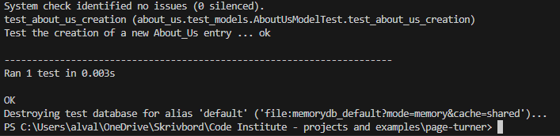
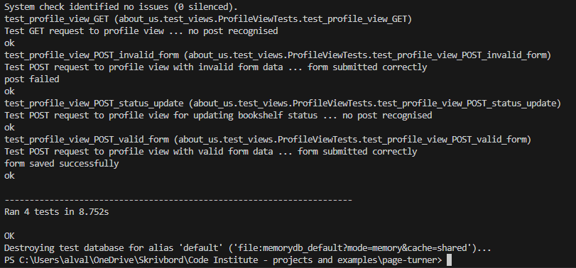
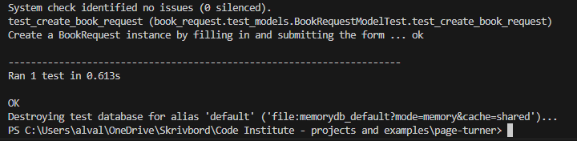
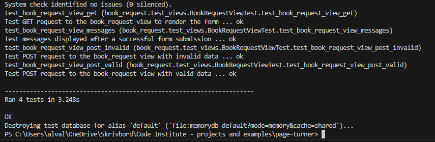
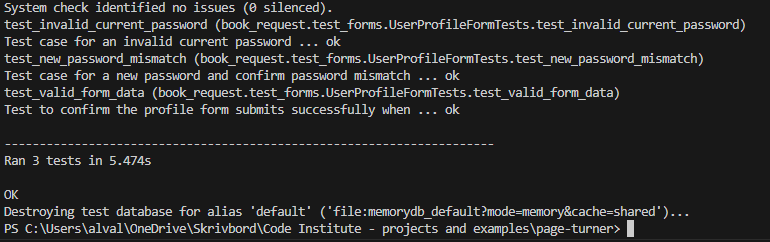
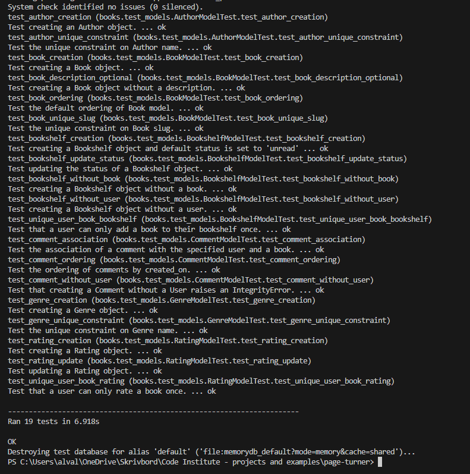
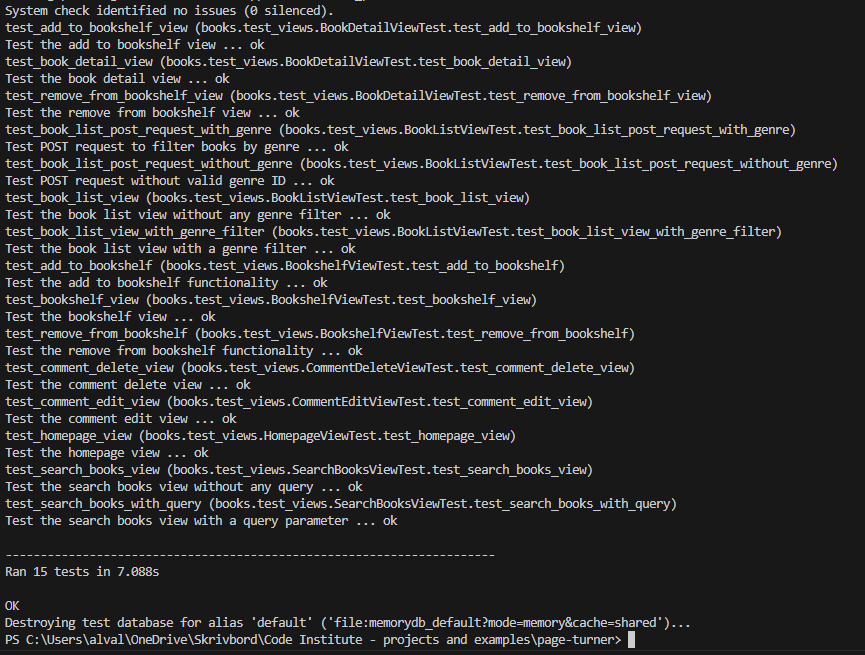
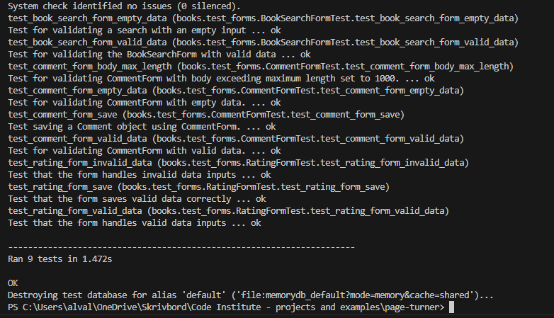
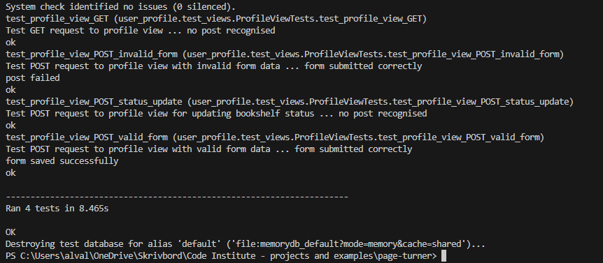
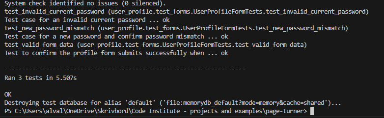

## Manual Testing

### General Testing

| Action | Expected results | Yes/No | Comments |
|--------|-----------------|--------|----------|
| Verify that the homepage loads correctly.| The page should load with all elements (logo, navigation bar, featured books). | Yes |  |
| Check the responsiveness on different devices (desktop, tablet, mobile). | The website should change images and styles to accomodate smaller screens | Yes |  |
| Ensure all navigation links work. | All the links should direct to the correct pages. | Yes |  |
| Test the dropdown menus and links within them. | Drop downs like navbar, status update, and filter function should redirect, update and filter. | Yes |  |


## User Testing
| Action | Expected results | Yes/No | Comments |
|--------|-----------------|--------|----------|
|  | Sign Up |  |  |
| Click on "Register" in the navbar. | User should get redirected to Register page. | Yes |  |
| Click on "Create an account now" button in the "Discover banner". | User should get redirected to Register page. | Yes |  |
| Click on "Create account" on Request a Book page. | User should get redirected to Register page. | Yes |  |
| Enter valid username. | Username has to be unique. | Yes |  |
| Enter valid emailadress (optional). | Field will only accept email address format. | Yes |  |
| Enter valid password. | Field will only accept secure passwords, must contain at least 8 characters and it can't be entirely numeric. | Yes |  |
| Enter valid password confirmation. | Field will only accept the same password from the previous field. | Yes |  |
| Click on the Sign Up button. | User should be redirected to the homepage with a confirmation message saying that they are logged in. | Yes |  |
|  | Log in |  |  |
| Click on Login in the navbar| User should get redirected to Login page. | Yes |  |
| Click on "Log in" on Request a Book page. | User should get redirected to Login page. | Yes |  |
| Enter valid username. | Field will only accept a valid username | Yes |  |
| Enter valid password. | Field will only accept a valid password to the username. | Yes |  |
| Click on the Sign In button | User should be redirected to the homepage with a confirmation message saying that they are logged in.| Yes |  |
|  | Log out |  |  |
| Click Log out from navbar| User should get redirected to a log out page to confirm logout. | Yes |  |
| Click "Logout" button in the center of the page. | Redirects user to home page. | Yes |  |
| Click browser back button. | User should still be logged out from the account. | Yes |  |
|  | Navbar |  |  |
| Click on "Home". | User should be taken to the home page. | Yes | Available to everyone. |
| Click on "Books". | User should get taken to the books page. | Yes | Available to everyone. |
| Click on "Request a book". | User should be taken to the "Request a book" page. If user is not logged in the options to login or register an account will appear and redirect the user. | Yes | Only available to registered users. |
| Click on "About us". | User should be taken to the "About us" page. | Yes | Available to everyone. |
| Click on the "search bar". | User should be able to start typing to search for a book or an author. | Yes | Available to everyone. |
| Click on the "user profile" icon. | User should be taken to their user profile and booklist. | Yes | Only available to registered users. |
|  | Books page |  |  |
| Click on "Filter by Genre". | User should be able to filer books by choosing a genre. | Yes | |
| Click on "next". | There should only be 9 books per page. When clicking next user should get redirected to the next page of books. | Yes |  |
| Click on "prev" | The user should get taken back to the previous page of books. | Yes |  |
| Click on a book | User should get taken to the book details page. | Yes |  |
|  | Book details |  |  |
| Click on "Add to Bookshelf". | Book should get added to the users Bookshelf and the button update to "Remove from Bookshelf". | Yes | Only available to registered users. | 
| Click "Remove from Bookshelf". | The book should get removed from the booklist and the button update to "add to bookshelf". | Yes | Only available for registered users. |
| Leave a comment/review | User can leave a comment on the book. | Yes | Only available for registered users. | 
| Click "Submit" to submit the comment. | The text "Your comment has been submitted and is awaiting approval" will appear. The user can then see their pending comment in the comment section. | Yes | Only available for registered users. |
| Click "Edit" button on comment. | The user should be able to edit the comment. If the comment has already been approved the changes will have to await approval. The timestamp of the comment will update. | Yes | Only available for registered users. |
| Click "Delete" button on comment. | There will be a pop-up asking you to verify that the comment should be deleted. | Yes | Only available for registered users. |
| Click "Close" on the pop-up | The pop-up will close and the comment will not be deleted. | Yes | Only available for registered users. |
| Click "delete" on the pop-up. | The comment will be deleted. | Yes | Only available for registered users. |
| Rate the book by clicking on the empty stars. | The stars should get coloured and the average rating of the book update. | Yes | Only available for registered users. |
| Change rating by clicking on the stars again. | The rating and average rating should update. | Yes | Only available for registered users. |
| Clicking the back button. | Takes you back to the previous page. | Yes |  |
| Clicking the back button after submitting a comment/rating or added a book to the bookshelf. | User should be taken back to the previous page without affecting the changes made by the user. | Yes |  |
|  | Request a book |  |  |
| Input title | The field is required and accepts a max length of 60 charachers. | Yes | Only available for registered users. |
| Input Author. | The field is required and accepts a max length of 60 charachers. | Yes | Only available for registered users. |
| Input Published Year. | The field is required and only accepts numeric values. | Yes | Only available for registered users. |
| Input Discription. | This field is not required. | Yes | Only available for registered users. |
| Click "Submit". | The book request gets submitted and a message saying "Thank you for your book recommendation!" | Yes | Only available for registered users. |
|  | User Profile |  |  |
| Click on "username" field and input new username. | Username will only update if the current password has been entered. | Yes | Only available for Registered Users |
| Click on "First name" field and input a first name. | First name is not required and will only update/register if the current password has been entered. | Yes | Only available for Registered Users |
| Click on "Last name" field and input a last name. | Last name is not required and will only update/register if the current password has been entered. | Yes | Only available for Registered Users |
| Click on "email" field and input/edit the email address. | Email address is not required and will only update/register if the current password has been entered. | Yes | Only available for Registered Users |
| Click on "New password" field and input a new password. | The password will only update if the current password and the confirm password has been entered. | Yes | Only available for Registered Users |
| Click on "Confirm password" field and input/confirm the new password. | The password will only update if the current password and new password field has been entered. | Yes | Only available for Registered Users |
| Click on "Save Changes". | The changes will only be updated if the form and the required fields are valid. | Yes | Only available for Registered Users |
| Click "delete" button. | Redirect to delete profile page. | Yes | Only available for Registered Users |
|  | Bookshelf |  |  |
| Click on "Set status" and pick one of the alternatives. | The status of the book should be updated. | Yes | Only available for Registered Users |
| Click on the book. | User should get redirected t the book details page. | Yes | Only available for Registered Users |
| Click "Remove from Bookshelf". | The book will be removed from the bookshelf. | Yes | Only available for Registered Users |
| Click the back button on book details page. | User should get taken back to the user profile with the changes to the bookshelf. | Yes | Only available for Registered Users |
| Click "Remove Book" button. | The book will be removed from the bookshelf and the message "This book has been removed from your Bookshelf!" will appear. | Yes | Only available for Registered Users |


## Automated Testing 

### Terminal Command
```
python3 manage.py test app_name.test_filename --verbosity=3 --settings=books.test_settings
```

This terminal command was used to run each of the test files within the PageTurner project individually. The file path to each of the test python files is specified in 'app_name.test_filename'. 
For example to run the automated test_models.py in the books app created to test the books models.py the following was executed in the terminal:
```
python3 manage.py test books.test_models --verbosity=3 --settings=books.test_settings
```
All models, forms and views have been tested within each app using automated testing.

## Automated Testing
### Django unit testing
The page_turner project consists of 4 main apps. Within these apps are automated testing files designed to test the models, forms and views within each app. We can run each of these tests seperately. I was aware of the want and need to implement automated testing from the begining of the porject. I chose to first complete the development of all funcitonality first and run the automated testing at the end. The automated tests found a few bugs related to the form handling and submission of invalid form entries making it quick and easy to locate and fix the bugs. On reflecton I would like to have, and will in the future implement and run automated testing along side development in order to increase productivity. 

### about_us App
**test_models.py**



**test_views.py**




### book_request App
**test_models.py**



**test_views.py**



**test_forms.py**




### books App
**test_models.py**



**test_views.py**



**test_forms.py**




### user_profile App
**test_views.py**



**test_forms.py**




The sqlite database was used when running automated tests.

The sqlite3 has not been used during the development of the project. The PostgresSQL database was instead used from the beginning of the project. 

Within each app I have created the automated testing files as required to test models, forms and views. I have deleted the test.py files from all apps along with and admin.py and models.py where they are not being used.

I have created a seperate test_settings.py located in the page_turner app along with my settings.py. This test_settings is called when running tests. It extends and overwrites parts of the settings.py required to connect to the sqlite database for testing.

To run each of the 14 test files the following command was used: 
```
python3 manage.py test <app name>.<test file name> --verbosity=3 --settings=page_turner.test_settings
```

## Validation
### HTML Validation

No warnings or errors were found when passing each of my HTML templates through the [W3C](https://validator.w3.org/) validator. I have manually run these checks by copying each of the HTML templates source code (Ctrl+U) and pasting it into the validator. I have also run the validator checks by directly passing in the deployed URL path of each deployed page. 

#### Complete HTML Validation Reports

- [Homepage - Report](documentation/w3c_html_validation/home-html-validator.png)

- [About Us - Report](documentation/w3c_html_validation/about-html-validator.png)

- [Books - Report](documentation/w3c_html_validation/books-html-validator.png)

- [Book Detail - Report](documentation/w3c_html_validation/details-html-validator.png)

- [Profile - Report](documentation/w3c_html_validation/profile-html-validator.png)

- [Request A Book - Report](documentation/w3c_html_validation/request-html-validator.png)

### CSS Validation

No warnings or errors were found when passing the css through the [W3C (Jigsaw)](https://jigsaw.w3.org/css-validator/#validate_by_uri). I have manually run these checks by copying each of the deployed page URLs and pasting them into the validator.

#### Complete CSS Validation Reports

- [Homepage - Report](documentation/w3c_css_validation/home-css-validator.png)

- [About Us - Report](documentation/w3c_css_validation/about-css-validator.png)

- [Books - Report](documentation/w3c_css_validation/books-css-validator.png)

- [Book Detail - Report](documentation/w3c_css_validation/details-css-validator.png)

- [Profile - Report](documentation/w3c_css_validation/profile-css-validator.png)

- [Request A Book - Report](documentation/w3c_css_validation/request-css-validator.png)

### JS Validation

No warning or error messages were found when passing the java script files through the [JSHint](https://www.jshint.com/) validator. However, the validator has picked up in the comments.js that the bootstrap variable is not defined, but this variable is needed for the generation of the modal. 

#### Complete Java Script Validation Reports

- [Back Button JS - Report](documentation/jshint_validation/back_button_jshint_validation.png)

- [Base JS - Report](documentation/jshint_validation/base_jshint_validation.png)

- [Comment JS - Report](documentation/jshint_validation/comment_jshint_validation.png)

- [Ratings JS - Report](documentation/jshint_validation/rating_jshint_validation.png)


### Python Validation

No warnings or errors were found when the python code was passed through Valentin Bryukhanov's [online validation tool](http://pep8online.com/). According to the reports, the code is [Pep 8-compliant](https://legacy.python.org/dev/peps/pep-0008/). This checking was done manually by copying python code and pasting it into the validator.

### Lighthouse validation

PageTurner has generally good scores when testing through Lighthouse except for performance testing that has gotten mixed results.

* [lighthouse validation](documentation/lighthouse.png)


## Bugs 

### Solved Bugs
#### Issue: Default Rating Value  
I encountered issues with setting the default rating value to `null`, which caused errors during the average rating calculation. To resolve this, I set the default rating value to `-1` and had the average rating calculation only for values between `1` and `5`.

```
class Rating(models.Model):
    user = models.ForeignKey(User, on_delete=models.CASCADE, related_name="ratings")
    book = models.ForeignKey(Book, on_delete=models.CASCADE, related_name="rater")
    rating = models.IntegerField(choices=[(i, i) for i in range (1, 6)], default=-1)
    last_updated = models.DateTimeField(auto_now=True)

    class Meta:
        unique_together = ('user', 'book') 
        
    def __str__(self):
        return f'{self.book.title} - {self.rating} Stars - Rated by: {self.user.username}'
```

#### Issue: Back Button not rendering previous page
When opening the book_detail view for a book from any page I had created a button that would return the previously returned page. This worked well until an action such as a GET or POST request was taken on the book_detail page that caused the book_detail view to re-render ultimately saving its prior instance as the previous page. So the back button simply rendered the book_detail view again. 
To solve this issue in the back_button.js I used the 
`document.addEventListener` for the `DOMContentLoaded` to get the `referrer` URL that brought the user to the book_detail.html. The next time the user uses the back button the referrer URL is stored using `const referrer = localStorage.getItem('bookDetailReferrer');` and returned to be used as the buttons href. 

```
//back_button.js file
document.addEventListener('DOMContentLoaded', function() {
    // Check if referrer is available and the user is landing on the book_detail page for the first time
    if (document.referrer && !localStorage.getItem('bookDetailReferrer')) {
        localStorage.setItem('bookDetailReferrer', document.referrer);
    }
});


function goBack() {
    // Get the stored referrer URL
    const referrer = localStorage.getItem('bookDetailReferrer');
    
    // Check if the referrer URL is available
    if (referrer) {
        // Navigate back to the referrer URL
        window.location.href = referrer;
        
        // Optionally, clear the stored referrer after navigating back
        localStorage.removeItem('bookDetailReferrer');
    } else {
        // Fallback if there is no stored referrer
        window.history.back();
    }
}

```

## Unsolved bugs

#### Issue: Lack of Max-Length for Input Fields
The input fields for features such as "Request a Book", "Edit User Settings" and "Register New Account" currently do not have a specified `max-length` beyond the default Django standards. This allows users to input an excessively large number of characters. I am aware that this is not best practice, but due to time constraints, I was unable to address it. However, I plan to fix this in future development.


